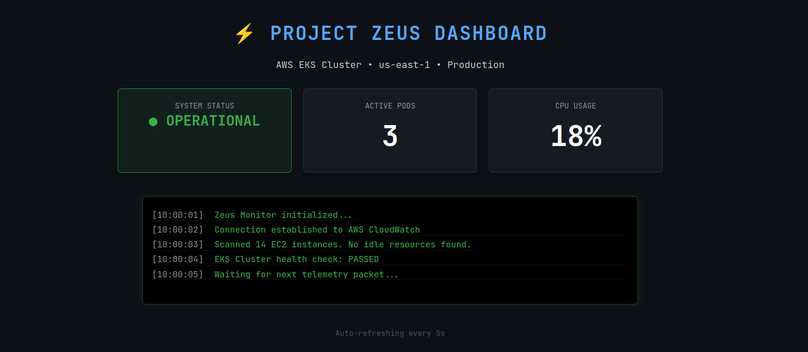

# Project Zeus ⚡
### Cloud Infrastructure Automation & DevOps Engine

**Project Zeus** is a comprehensive engineering initiative designed to eliminate cloud resource waste. It acts as an **Infrastructure Engine** that automates the provisioning, monitoring, and lifecycle management of cloud resources.

It is built with **AWS (Lambda, EKS)**, defined via **Terraform**, containerized with **Docker**, and managed through **Azure DevOps** pipelines.



---
### 📋 Prerequisites (For Production Deployment)
While the Simulation Mode runs on any machine with Docker, deploying to a live cloud environment requires:

1.  **AWS Account:** Active account with `AdministratorAccess` permissions.
2.  **AWS CLI:** Installed and configured locally via `aws configure`.
3.  **Azure DevOps:** A project set up with a **Service Connection** to your AWS environment.
4.  **Terraform CLI:** Installed (v1.0+).
### 🏗️ Architecture & Components
This project is a modular system composed of four distinct pillars, designed for scalability and reproducibility.

#### 1. Cloud Infrastructure (AWS & Terraform)
* **Component:** `/infrastructure`
* **Function:** Contains **Terraform (IaC)** blueprints that programmatically define the data center.
    * `main.tf`: Provisions the **EKS Kubernetes Cluster** for high-availability application hosting.
    * `variables.tf`: Configures the **AWS Lambda** functions used for serverless resource monitoring.
* **Usage:** Run `terraform plan` in this directory to view the infrastructure blueprint before deployment. This ensures the environment is idempotent and eliminates manual configuration drift.

#### 2. Containerization (Docker)
* **Component:** `Dockerfile`
* **Function:** A multi-stage build script that packages the Python 3.9 runtime, installs Flask dependencies, and optimizes the image for production.
* **Usage:** This containerization ensures the application runs identically on a local developer laptop and a production Kubernetes node, solving the "it works on my machine" problem.

#### 3. DevOps & CI/CD (Azure & Automation)
* **Component:** `/pipelines`
* **Function:** Stores the automation logic.
    * `azure-pipelines.yml`: A declarative pipeline configuration that triggers on every commit to `main`. It automatically runs unit tests, builds the Docker image, and pushes artifacts to the registry.
* **Usage:** Connect this repository to an Azure DevOps project to enable automated deployments, reducing release time from hours to minutes.

#### 4. The "Brain" (Python Scripting)
* **Component:** `/src`
* **Function:** The core logic engine.
    * `app.py`: A **Flask** microservice acting as the control plane. In "Simulation Mode," it generates real-time telemetry to model high-load scenarios.
    * `scripts/health_check.sh`: A **Bash** utility for local system administration and Linux health monitoring.

---

### 🚀 How to Use (Quick Start)
You can run the full engine on your local machine using Docker. The application currently runs in **Simulation Mode**, generating mock telemetry data to demonstrate the visualization capabilities without incurring AWS costs.

1. **Build the Engine**
   ```bash
   docker build -t zeus-monitor .
