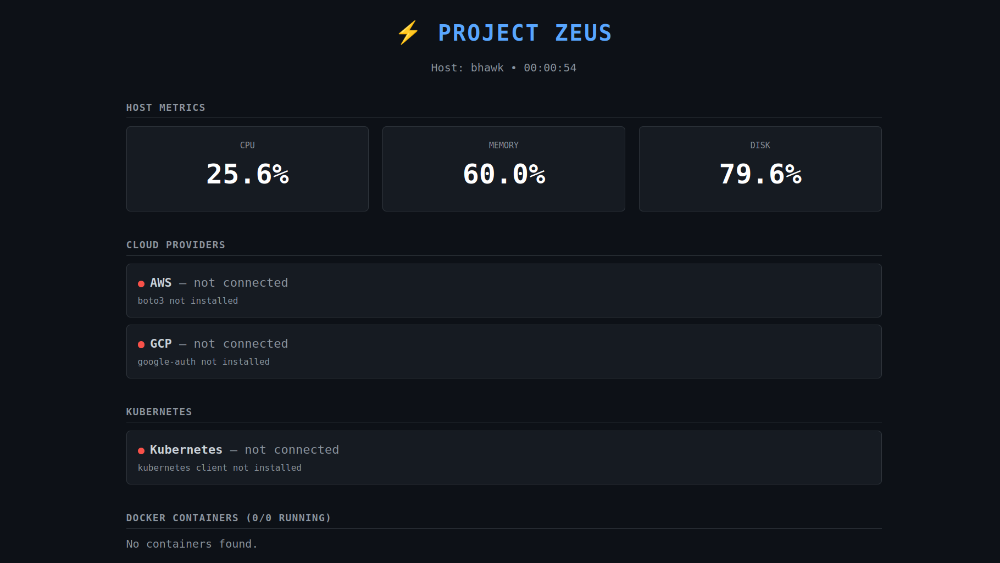

# Project Zeus

A Flask dashboard that reports real host metrics, Docker containers, AWS/GCP inventory, and Kubernetes cluster summaries. No simulated data — if a source isn't reachable the dashboard says so.



See [ARCHITECTURE.md](./ARCHITECTURE.md) for module-by-module detail.

## What it shows

- Host CPU / memory / disk via `psutil`
- Local Docker containers via the Docker socket
- AWS account / EC2 / S3 via `boto3`
- GCP project / Compute / Storage via `google-cloud` SDKs
- Kubernetes cluster version / nodes / pods / namespaces via the official `kubernetes` client
- JSON for each at `/api/host`, `/api/containers`, `/api/aws`, `/api/gcp`, `/api/kubernetes`, `/health`

## Quick start

```bash
cd src
python3 -m venv .venv
source .venv/bin/activate
pip install -r requirements.txt
python app.py
```

Open <http://localhost:8080>. Each panel will be green or "not connected" depending on what credentials are on the machine — see [ARCHITECTURE.md](./ARCHITECTURE.md#credentials) for the credential chains.

Subsequent runs only need `source .venv/bin/activate && python app.py`.

> **Note for VS Code Flatpak users:** the integrated terminal runs inside the Flatpak sandbox and can't access `/var/run/docker.sock`. Run the server from a host terminal (GNOME Terminal / Konsole / Kitty / etc.) so the Docker panel can see your local containers.

## Run in Docker

```bash
docker build -t zeus-monitor .

docker run -p 8080:8080 \
  -v /var/run/docker.sock:/var/run/docker.sock \
  -v ~/.aws:/root/.aws:ro \
  -v ~/.config/gcloud:/root/.config/gcloud:ro \
  -v ~/.kube:/root/.kube:ro \
  zeus-monitor
```

Drop any mount you don't need; that source will report unavailable.

## Deploy to Kubernetes

Two paths.

**You already have a cluster:**
```bash
kubectl apply -f deploy/kubernetes/
```
See [deploy/kubernetes/README.md](./deploy/kubernetes/README.md).

**You want a fresh GKE Autopilot cluster:**
```bash
cd deploy/terraform
terraform init
terraform apply -var="project_id=YOUR_GCP_PROJECT" -var="image=YOUR_REGISTRY/zeus-monitor:1"
```
See [deploy/terraform/README.md](./deploy/terraform/README.md).

## Repository layout

```
src/                   Python source — one module per data source
deploy/kubernetes/     YAML manifests
deploy/terraform/      GKE Autopilot + app deployment
Dockerfile
scripts/health_check.sh
ARCHITECTURE.md
LICENSE
```

## License

MIT.
